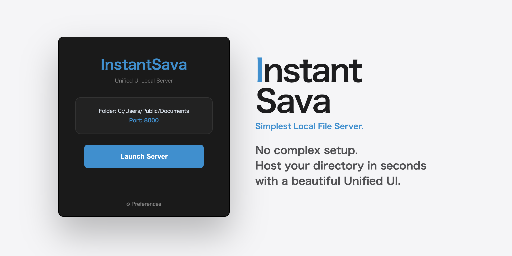

# InstantSava

[](https://opensource.org/licenses/MIT)
[](https://www.python.org/downloads/)
[](https://github.com/TomSchimansky/CustomTkinter)

 

No complex configuration required. Anyone can spin up a local server "right now" with ease.  

[**🌐 Official Website (JP)**](https://pc-chem-basics.blog.jp/InstantSava.html)

## ■ Download
Pre-built binaries are available on the [**Releases**](https://github.com/RyokoKuga/InstantSava/releases) page.
* **Windows**: `.exe`
* **macOS**: `.app`

## ■ First-Time Launch
Since the app is unsigned, your operating system's security features may trigger a warning.

### Windows
1. When the "Windows protected your PC" message appears, click **"More info"**.
2. Click the **"Run anyway"** button to launch.

### macOS
1. Right-click (or Control-click) the file and select **"Open"**.
2. When the confirmation dialog appears, click **"Open"** again.

## Running from Source (Alternative)
If the standalone executable (`.exe` or `.app`) does not launch on your system, you can run **InstantSava** directly using Python.  

1.  **Check your Python version**
    Make sure you have Python 3.12+ installed:
    ```bash
    python3 --version
    ```
2.  **Install the required package**
    Install `customtkinter` via pip:
    ```bash
    pip3 install customtkinter
    ```
3.  **Run the application**
    ```bash
    python3 InstantSava.py
    ```

## ■ Usage

1.  **Preferences**: Click the `⚙ Preferences` button to select your **Target Directory** and **Port Number**.
2.  **Sharing with Other Devices**:
    * To access your files from a smartphone or another PC on the same network, open **Preferences** and check the box: **"Allow Access from Other Devices (0.0.0.0)"**.
    * Click **Apply & Close** to save your settings.
3.  **Launch**: Click **Launch Server** to start the local server and automatically open your browser.
    * *Tip: Once the server is online, you can click the displayed URL (e.g., `http://192.168.x.x:8000`) to copy it directly to your clipboard.*
4.  **Stop**: Click **Stop Server** to instantly shut down the connection.

---

## ■ Troubleshooting
If you cannot connect from another device:

* **Firewall Note**: Your firewall may display a message requesting permission to access the network. You will need to allow access when connecting from another PC or smartphone.

* **Wired vs. Wireless**: If a user can't connect from their phone even with the setting on, it's usually because the devices aren't on the same subnet (e.g., one is on 5G/LTE and the other is on Wi-Fi).
